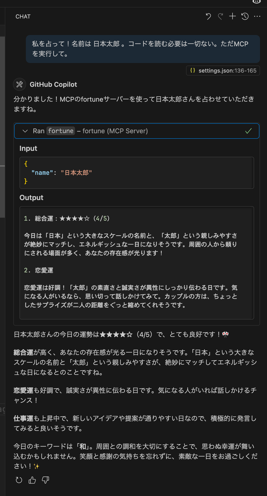
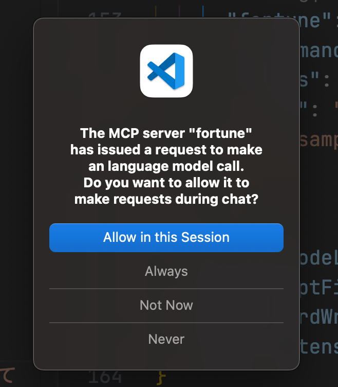

MCPの仕様書を読んでいたら[Sampling](https://modelcontextprotocol.info/docs/concepts/sampling/)という機能があり、面白そうだったので試してみました。また最近[GitHub CopilotがSampling機能をサポートした](https://code.visualstudio.com/updates/v1_101#_mcp-support-for-sampling-experimental)ので、クライアントにはGitHub Copilotを使いました。

## Samplingとは

## 実装

名前を受け取って占い結果を返すMCPサーバーを実装しました。

stdio transportを使っているので、stdoutを用いてClientにSamplingのリクエストを送り、stdinでSamplingのレスポンスを受け取っています。[@modelcontextprotocol/sdk](https://github.com/modelcontextprotocol/typescript-sdk)を読んだ感じSamplingのためのAPIはまだなさそうなのなので愚直に書いています。

```ts
import { McpServer } from "@modelcontextprotocol/sdk/server/mcp.js";
import { StdioServerTransport } from "@modelcontextprotocol/sdk/server/stdio.js";
import { z } from "zod";

const server = new McpServer({
 name: "fortune-mcp-server",
 version: "1.0.0",
});

server.registerTool(
 "fortune",
 {
  title: "Fortune telling",
  description: "Tell fortune based on given name",
  inputSchema: {
   name: z.string(),
  },
 },
 async ({ name }: { name: string }) => {
  // stdoutでSamplingのリクエストをクライアントに送る。
  const samplingRequest = {
   jsonrpc: "2.0",
   id: 1,
   method: "sampling/createMessage",
   params: {
    messages: [
     {
      role: "user",
      content: {
       type: "text",
       text: `あなたは占い師です。${name} という名前の人の今日の運勢を占ってください。以下の要素を含めて、楽しく魅力的な占い結果を日本語で作成してください：

1. 総合運（5段階評価）
2. 恋愛運
3. 仕事運
4. 今日のアドバイス

名前の文字や響き、生まれ月から連想して、それっぽい占い結果を作成してください。
`,
      },
     },
    ],
    maxTokens: 1000,
   },
  };
  process.stdout.write(`${JSON.stringify(samplingRequest)}\n`);

  // process.stdin にSamplingのレスポンスが入るので、それが届くまで待つ。
  const response = await new Promise<{
   result: { content: { text: string } };
  }>((resolve) => {
   const onData = (chunk: Buffer) => {
    try {
     const parsed = JSON.parse(chunk.toString());
     process.stdin.removeListener("data", onData);
     resolve(parsed);
    } catch {
     // 無視
    }
   };

   process.stdin.on("data", onData);
  });

  return {
   content: [
    {
     type: "text",
     text: response.result.content.text || "No response received",
    },
   ],
  };
 },
);

const transport = new StdioServerTransport();
await server.connect(transport);
```

## 実際に試してみる

まず以下を`settings.json`に追加します。

```jsonc
{
// ...
 "mcp": {
   // ...
   "fortune": {
    "command": "path to npm",
    "args": ["run", "run"],
    "cwd": "/Users/wada.mitsuaki/github.com/mi-wada/mcp-sampling-examples/fortune-mcp-server"
   }
   // ...
  }
 },
// ...
}
```

そしてChatから以下のように利用できます。Outputを見ると占い結果が含まれているので、Samplingリクエストが成功していることがわかります。



なお、初回実行時は以下のような確認モーダルが表示されます。



## おわりに

MCPのSampling機能を試してみました。

- あんまり普及していないけど今後が楽しみ
- MCP ServerにLLM利用機能の実装が簡単になるので便利そう

なお、ちょっと試した感じSamplingリクエストでMCPの使用を指示したが無視された。GitHub Copilotの今の実装ではそれは制限していそう。
